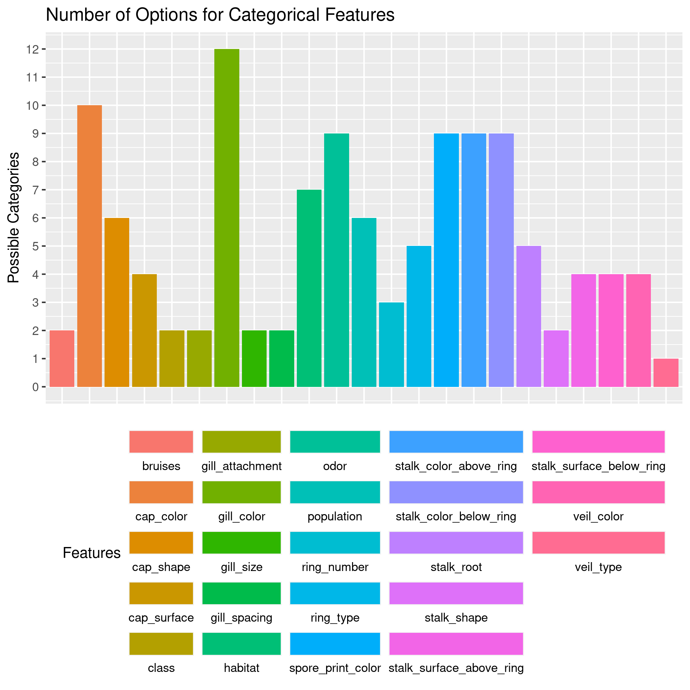
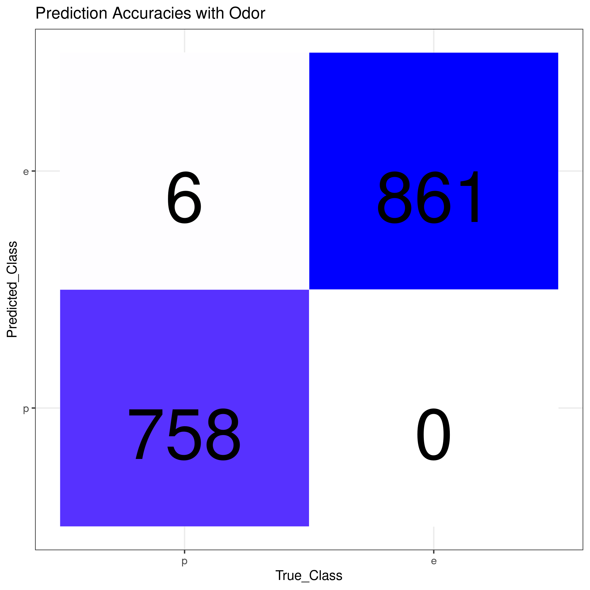
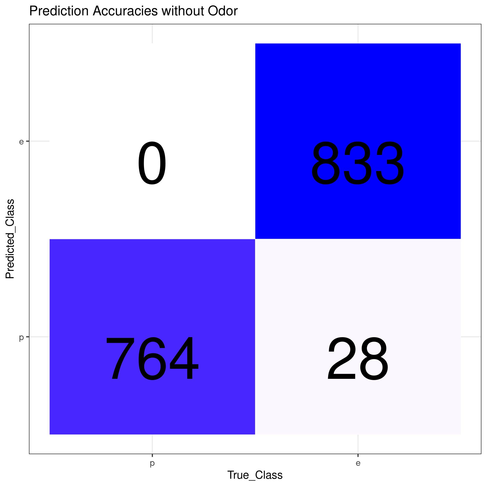

```{r setup, include=FALSE}
knitr::opts_chunk$set(echo = TRUE)
```

## Introduction

Mushrooms are a fungi that are commonly used in food and sometimes for medicinal purposes, but the wide variety of characteristics across mushroom types can make distinction of species or sub-species difficult. This becomes even more challenging due to the fact that many mushroom types have evolved to have similar colors, patterns, and shapes due to varying evolutionary forces. When looking for edible mushrooms, knowing the difference between subtypes could easily be a matter of life and death, so finding a lightweight model that can classify mushrooms through a few questions about its characteristics from a phone could be very useful for hikers and mycologists alike.

This project aims to both explore what differentiates mushroom types/subtypes and create the most lightweight model possible for accurately discriminating edible from poisonous mushrooms given a fairly limited dataset containing only categorical data.  

### Datasets

The dataset we're using is found [on Kaggle and is publicly available.](https://www.kaggle.com/uciml/mushroom-classification) It consists of quite a few aspects of mushrooms and associated pictures

```
Attribute Information: 

classes: edible=e, poisonous=p

cap-shape: bell=b,conical=c,convex=x,flat=f, knobbed=k,sunken=s

cap-surface: fibrous=f,grooves=g,scaly=y,smooth=s

cap-color: brown=n,buff=b,cinnamon=c,gray=g,green=r,pink=p,purple=u,red=e,white=w,yellow=y

bruises: bruises=t,no=f

odor: almond=a,anise=l,creosote=c,fishy=y,foul=f,musty=m,none=n,pungent=p,spicy=s

gill-attachment: attached=a,descending=d,free=f,notched=n

gill-spacing: close=c,crowded=w,distant=d

gill-size: broad=b,narrow=n

gill-color: black=k,brown=n,buff=b,chocolate=h,gray=g, green=r,orange=o,pink=p,purple=u,red=e,white=w,yellow=y

stalk-shape: enlarging=e,tapering=t

stalk-root: bulbous=b,club=c,cup=u,equal=e,rhizomorphs=z,rooted=r,missing=?

stalk-surface-above-ring: fibrous=f,scaly=y,silky=k,smooth=s

stalk-surface-below-ring: fibrous=f,scaly=y,silky=k,smooth=s

stalk-color-above-ring: brown=n,buff=b,cinnamon=c,gray=g,orange=o,pink=p,red=e,white=w,yellow=y

stalk-color-below-ring: brown=n,buff=b,cinnamon=c,gray=g,orange=o,pink=p,red=e,white=w,yellow=y

veil-type: partial=p,universal=u

veil-color: brown=n,orange=o,white=w,yellow=y

ring-number: none=n,one=o,two=t

ring-type: cobwebby=c,evanescent=e,flaring=f,large=l,none=n,pendant=p,sheathing=s,zone=z

spore-print-color: black=k,brown=n,buff=b,chocolate=h,green=r,orange=o,purple=u,white=w,yellow=y

population: abundant=a,clustered=c,numerous=n,scattered=s,several=v,solitary=y

habitat: grasses=g,leaves=l,meadows=m,paths=p,urban=u,waste=w,woods=d
```

## Preliminary Data Exploration

The first step in describing this dataset is determining how balanced it is in terms of predictive classes. Imbalance can lead to problems down the line with accuracy and descriptiveness of a model.


Turns out, they're pretty evenly balanced, which is good because it allows us to have confidence in a model without having to weight classification outcomes drastically. Oftentimes a dataset will perform better at categories with more samples because it has more examples to learn from, and often we try to avoid this pitfall by either having as even of a sample distribution as possible or by weighting our loss function by the proportion of samples for each class.

Analyzing the amount of categorical options gives us an idea of the complexity of our features. 



That's a decent amount, and there are multiple ways we could approach this. The first analysis will be an association test to see how correlated all of the variable options are with each other, and subsequently if there are any clear paths a decision tree could take or if we'll need a more complex model. Building a model that's overly complex is a waste of resources and time, so we'll try to get the simplest method first for getting to an accurate prediction possible.


#### Basic Association Testing

First thing we'll do try to fit a decision tree to the data as a binary classifier. A decision tree is nice for a few reasons:
  - It is extremely flexible when handling categorical data, so we don't have to worry about transformations or anything
  - It's lightweight, which is great for situations like this where maybe we're considering making this model into a phone app and can't run  complex models on the hardware.


Looks like the odor feature is extremely predictive, but how accurate is it when tested?


Drawing up a quick confusion matrix to visualize predictive accuracy shows that 

But there's a pretty big problem with this, we can't assume everyone can smell the same. While it's safe to assume that the stronger smelling ones are pretty easy to differentiate, visual inspection is both easier to do by humans and by machines, so let's see if we can get good predictive power without the odor feature. 




Turns out, we can! And, in a stroke of luck, it actually goes the opposite direction the odor-included tree did and overestimates how many are poisonous, without predicting any in our test set as falsely edible. In the context of health, this is an extremely important difference and we should choose this model even if it is slightly less accurate. 

### Installation and Running

To install:

```{bash}
git clone https://github.com/Lswhiteh/bios611-project1
#Build container
source aliases.sh
dbuild
r
```

- Open a web browser to `http://localhost:8787`
    - Username: `rstudio`
    - Password: `<your linux user password>`

In the terminal:
```
make all
```

And that's it! There should be a pdf called "Mushroom_analysis.pdf" in the base project directory with the completed writeup/figures.


```{r cars}
summary(cars)
```

## Including Plots

You can also embed plots, for example:

```{r pressure, echo=FALSE}
plot(pressure)
```

Note that the `echo = FALSE` parameter was added to the code chunk to prevent printing of the R code that generated the plot.
