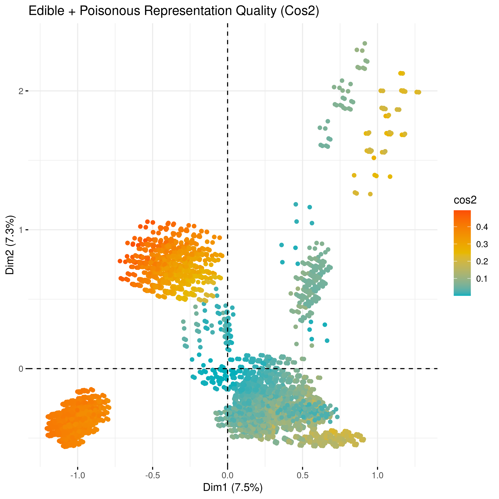
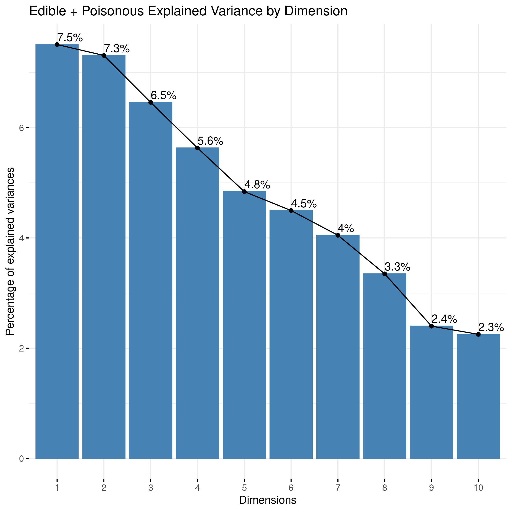
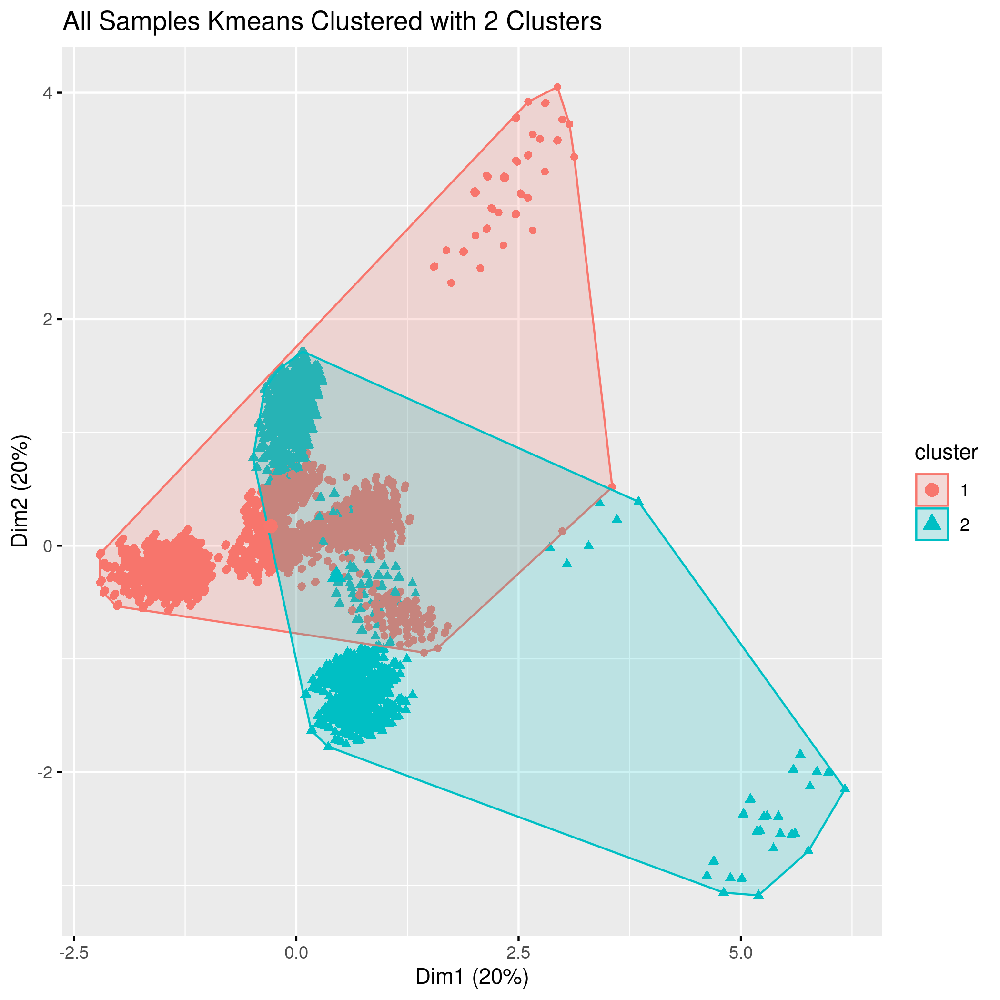
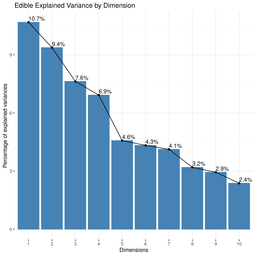
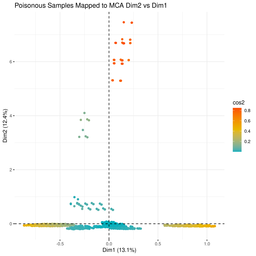
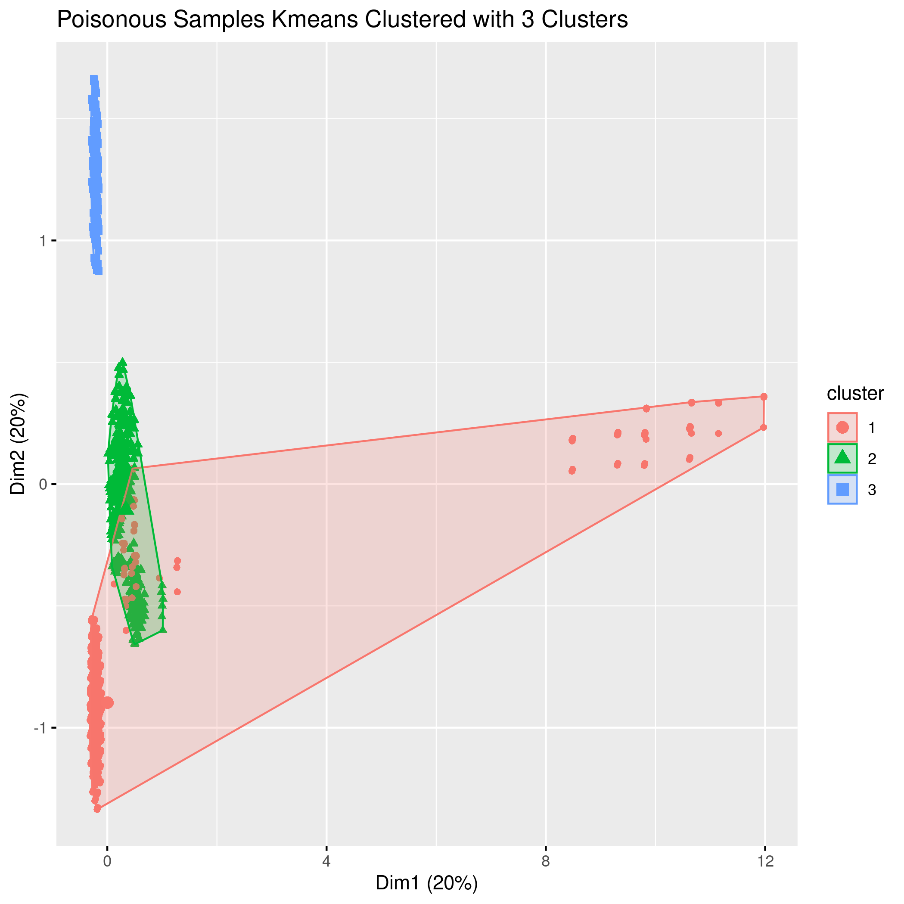

```{r setup, include=FALSE}
knitr::opts_chunk$set(echo = TRUE)
```

## Introduction

Mushrooms are a fungi that are commonly used in food and sometimes for medicinal purposes, but the wide variety of characteristics across mushroom types can make distinction of species or sub-species difficult. This becomes even more challenging due to the fact that many mushroom types have evolved to have similar colors, patterns, and shapes due to varying evolutionary forces. When looking for edible mushrooms, knowing the difference between subtypes could easily be a matter of life and death, so finding a lightweight model that can classify mushrooms through a few questions about its characteristics from a phone could be very useful for hikers and mycologists alike.

This project aims to both explore what differentiates mushroom types/subtypes and create the most lightweight model possible for accurately discriminating edible from poisonous mushrooms given a fairly limited dataset containing only categorical data.  

### Datasets

The dataset we're using is found [on Kaggle and is publicly available.](https://www.kaggle.com/uciml/mushroom-classification) It consists of quite a few aspects of mushrooms and associated pictures

Information on each variable and it's associated shorthand notation can be found in Appendix A.


## Preliminary Data Exploration

The first step in describing this dataset is determining how balanced it is in terms of predictive classes. Imbalance can lead to problems down the line with accuracy and descriptiveness of a model.

{width=50%}

Turns out, they're pretty evenly balanced, which is good because it allows us to have confidence in a model without having to weight classification outcomes drastically. Oftentimes a dataset will perform better at categories with more samples because it has more examples to learn from, and often we try to avoid this pitfall by either having as even of a sample distribution as possible or by weighting our loss function by the proportion of samples for each class.

Analyzing the amount of categorical options gives us an idea of the complexity of our features. 

{width=50%}

That's a decent amount, and there are multiple ways we could approach this. The first analysis will be an association test to see how correlated all of the variable options are with each other, and subsequently if there are any clear paths a decision tree could take or if we'll need a more complex model. Building a model that's overly complex is a waste of resources and time, so we'll try to get the simplest method first for getting to an accurate prediction possible.

---

## Decision Tree and Feature Pruning

#### Decision Tree

First thing we'll do try to fit a decision tree to some training data as a binary classifier. A decision tree is nice for a few reasons:
  - It is extremely flexible when handling categorical data, so we don't have to worry about transformations or anything
  - It's lightweight, which is great for situations like this where maybe we're considering making this model into a phone app and can't run  complex models on the hardware.


{width=50%}

Looks like the odor feature is extremely predictive, and this is a pretty easy problem to solve according to how small our decision tree is. To determine how well the tree can discriminate edible from poisonous samples on unknown testing data we'll plot a confusion matrix of predictions. This is a simple plot that shows the True label against the predicted label, and the diagonal is the count of how the prediction matches with the true label.


Drawing up a quick confusion matrix to visualize predictive accuracy shows that this decision tree is extremely accurate, though not perfect, and unfortunately tends towards predicting a mushroom as edible even when it's poisonous. Obviously this is a sub-par result when it comes to sickness/death from eating a mushroom, so adjusting the features the model is working with might get us a better predictive situation.

There's another large issue with using odor as the main predictor for a decision tree: we can't assume everyone can smell the same. While it's safe to assume that the stronger smelling ones are pretty easy to differentiate, visual inspection is both easier to do by humans and by and will be far more consistent than a multitude of options for smell, so the first way we'll manipulate the featureset is by removing the odor feature and re-examining the model.

{width=50%}

It's clear that this decision tree is more varied, and more features are being taken into consideration. This could mean it has reduced accuracy from removing a strong predictive variable, but the best way to check against that is by repeating predictions on the test set with the new model:

{width=50%}

Turns out, it is still highly accurate.In a stroke of luck, it actually goes the opposite direction the odor-included tree did and overestimates how many are poisonous, without predicting any in our test set as falsely edible. In the context of health, this is an extremely important difference and we should choose this model even if it is slightly less accurate. This decision tree trained on the data without the odor feature is preferable both from a usability and prediction standpoint, and will be the chosen model going forward. 


## Dimensionality Reduction and Clustering

While useful to have a good discriminating supervised model for predicting on new data, it's also good to spend some time exploring the data for other interesting features if present. This can be a little difficult on this dataset due to it being completely categorical, so deciding on a method for representing the data is important for downstream analysis. 

#### Multiple Correspondance Analysis

Multiple correspondance analysis (MCA) can be viewed as the counterpart to PCA for categorical data. It uses an extension of the multiple correspondance algorithm to represent categorical features in a low-dimensional Euclidian space. This is useful because this low-dimension featureset can then be used for things such as K-means clustering without having to apply transformations to the data to make it continuous for the purposes of clustering. 

The actual application of MCA in R is straightforward, the class labels were removed from the dataset and the resulting data can be visualized below as a plot of the top two variance-explaining dimensions against each other with the class labels as the color to see if there is any obvious delineation between the two classes. The COS2 distance is a measurement of importance for principle components for observed variables, and can give an indication as to how strongly the samples are affecting the lower-dimensional spaces.

{width=50%} {width=50%}
There is a little bit of separation, especially with the sub-groupings of poisonous samples, buut there is also quite a bit of mixing as well. At this point K-means clustering will give us an idea if they're easily separable, and mabye inform us of the structure of the data. The amount of clusters to use is sometimes determined by a scree plot of how much variance each dimension explains of the MCA, as shown below for this data.



Typically one would look for a sharp decrease in variance, and choose the number of dimensions before the drop as the number of clusters. We don't have such drastic differences here, which could indicate something about the quality of this MCA process, but will make it hard to choose the number of clusters. For now 2 clusters are selected to see if there's any obvious separation:



Again, we see what look to be some pretty distinct sub-clusters, but overall they're not extremely separable. 

This approach can be taken further to analyze deeper structure, such as there being different clustering behaviors if only the edible or poisonous samples are analyzed? The same procedure as above can be repeated for such a question.

{width=50%} {width=50%}

Using the scree plot for edible samples it would seem 4 clusters are appropriate but the quality is less than stellar, as seen below. 


{width=50%}

Interestingly, for the poisonous samples, most of them lay along one dimension with a few very highly Dimension 2-associated samples.

{width=50%}
There's a large variance drop after 3 dimensions, so this was chosen as the K for k-means. The resulting clustering is highly differentiated, the best of all of them. Without more information about the nature of the poisonous samples however, it's difficult to fully understand what these clusters could represent. 

 

All things considered the ability to create a very lightweight supervised model using only categorical variables is great, but in terms of structures within the data MCA analysis and k-means was not sufficient to find anything interesting aside from some sub-groups within the poisonous mushrooms. It's not clear whether there just is no underlying structure or if this would require a stronger analysis, but these basic methods found nothing of interest. 

---

## Appendix
### A - Dataset Labeling and Shorthand
```
Attribute Information: 

classes: edible=e, poisonous=p

cap-shape: bell=b,conical=c,convex=x,flat=f, knobbed=k,sunken=s

cap-surface: fibrous=f,grooves=g,scaly=y,smooth=s

cap-color: brown=n,buff=b,cinnamon=c,gray=g,green=r,pink=p,purple=u,red=e,white=w,yellow=y

bruises: bruises=t,no=f

odor: almond=a,anise=l,creosote=c,fishy=y,foul=f,musty=m,none=n,pungent=p,spicy=s

gill-attachment: attached=a,descending=d,free=f,notched=n

gill-spacing: close=c,crowded=w,distant=d

gill-size: broad=b,narrow=n

gill-color: black=k,brown=n,buff=b,chocolate=h,gray=g, green=r,orange=o,pink=p,purple=u,red=e,white=w,yellow=y

stalk-shape: enlarging=e,tapering=t

stalk-root: bulbous=b,club=c,cup=u,equal=e,rhizomorphs=z,rooted=r,missing=?

stalk-surface-above-ring: fibrous=f,scaly=y,silky=k,smooth=s

stalk-surface-below-ring: fibrous=f,scaly=y,silky=k,smooth=s

stalk-color-above-ring: brown=n,buff=b,cinnamon=c,gray=g,orange=o,pink=p,red=e,white=w,yellow=y

stalk-color-below-ring: brown=n,buff=b,cinnamon=c,gray=g,orange=o,pink=p,red=e,white=w,yellow=y

veil-type: partial=p,universal=u

veil-color: brown=n,orange=o,white=w,yellow=y

ring-number: none=n,one=o,two=t

ring-type: cobwebby=c,evanescent=e,flaring=f,large=l,none=n,pendant=p,sheathing=s,zone=z

spore-print-color: black=k,brown=n,buff=b,chocolate=h,green=r,orange=o,purple=u,white=w,yellow=y

population: abundant=a,clustered=c,numerous=n,scattered=s,several=v,solitary=y

habitat: grasses=g,leaves=l,meadows=m,paths=p,urban=u,waste=w,woods=d
```
